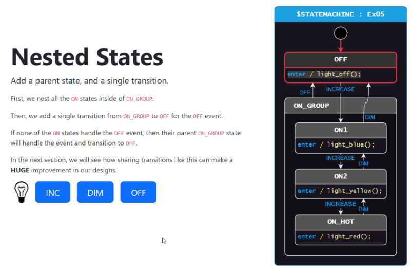

# Install required tool 📦
Install `dotnet` [version 6 or greater](https://dotnet.microsoft.com/en-us/download/dotnet/sdk-for-vs-code).

Then install `dotnet-script` with the command:
```
dotnet tool install -g dotnet-script
```

Hints: either open a command prompt window outside of VSCode, or `Menu->Terminal->New Terminal` to have the above done in VSCode. 

<br>

# Download tutorial-2
You would have downloaded at least th contents in `tutorial-2` onto your local computer. This directory contains `lesson-0` to `lesson-5`. In VSCode, `Menu->File->Open Folder...` and select one of these to work on one lesson at a time. 


<br>

# Draw.io
StateSmith generate source code from your state machine diagram. Draw.io is used to construct such diagram. In `tutorial-2`, these diagrams are drawn for you so you can concentrate to mentally associate the source code with the various elements in the diagram. Still, you will need Draw.io to view them. Please keep this in mind. It will be mentioned gain in due course.  


<br>

# A preview
Here is a concrete example demonstrating "how it works".   

An event-driven state machine is implemented on the left. Events such as mouse click is handled by the source code generated by StateSmith - from the Draw.io diagram on the right. The animation shows state and transition on the right corresponding to user action on the left.   

[   ]

The following link brings you to more examples. 

https://statesmith.github.io/fundamentals-1/

<br>

# Next
StateSmith can generate source code of your state machine in many programming language. The example above is JavaScript code being executed by a web browser. Lessons in `tutorial-2` are also JavaScript-based to provide the widest and fastest success across platform. Any OS that hosts VSCode coupled with any web browser will be able to run our JavaScript examples. 
⏭️ See [lesson-1 README](../lesson-1/README.md).
