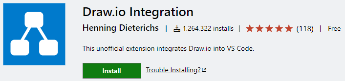
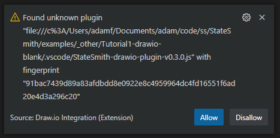

# Install The `draw.io vscode` Extension
Install the popular [vscode draw.io extension](https://marketplace.visualstudio.com/items?itemName=hediet.vscode-drawio).

 

# Open vscode In Project Repo Root (Or Each Lesson Dir)
Why? Simply because the `.vscode/settings.json` files in each lesson directory (or repo root) are setup to load the StateSmith plugin when you open a drawio file. More info available on the [Use with vscode wiki page](https://github.com/StateSmith/StateSmith-drawio-plugin/wiki/Use-with-vscode) if you want to use different paths or run into problems.

 

# Allow our plugin to load
Assuming you've installed the vscode extension above, open the `LightSm.drawio.svg` file with vscode.

The vscode-drawio extension will ask you if you want to load the StateSmith-drawio-plugin:

Click `Allow` if you trust it. I do :) You can see and even tweak your local copy source.

# On To The Next Lesson
⏭️ You can now head to [README-c.md](./README-c.md).
