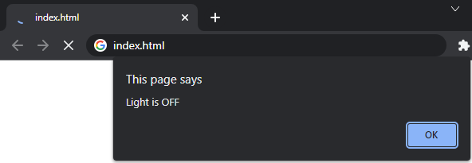
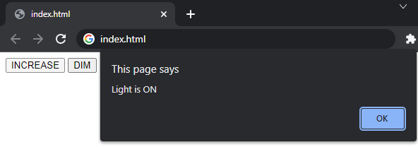

# The Image Is The Source!
One of the really cool features of draw.io is that the viewable svg file is also the design - as shown below. The below svg image is used by StateSmith to generate working state machine code. This is pretty excellent!


<br>

# WHAT!? This Is A Web Example!? 😱
Don't worry, there is a language specific example in a later lesson.

All the **non**-language specific examples will use html/javascript because everyone has a browser that can run them.


<br>

# Generate The State Machine Code
Run the below command in this (`lesson-1`) directory to run StateSmith on the diagram file. There will be a bit of a delay the first time you run this command as it will download StateSmith, compile the code generation script and then run it.
```
dotnet-script code_gen.csx
```
You should see the following:
```
StateSmith Runner - Compiling file: `LightSm.drawio.svg` (no state machine name specified).
StateSmith Runner - State machine `LightSm` selected.
StateSmith Runner - Writing to file `LightSm.js`.
StateSmith Runner - Finished normally.
```


<br>

# Interact With The State Machine 🌍
Now that we've generated the state machine JavaScript code, let's interact with it.
Open `index.html` with a web browser. You will get an alert dialog box saying "Light is OFF".



Close the alert dialog and press the `INCREASE` button. You'll get a message saying "Light is ON".



These are the exact strings we defined in our state machine diagram.


<br>

# StateSmith Runs Your Exact Code
By default, StateSmith outputs the **exact same action code** you put in your diagram. In a later section we will cover `Expansions` which help keep your designs concise and readable.


<br>

# What Happened In The Example?
The example `index.html` file is very simple. It creates a state machine, starts it, then dispatches events to it when a button is pressed.

```html
<html>
    <script src="LightSm.js"></script> <!-- generated state machine file -->
    <script>
        let stateMachine = new LightSm();
        stateMachine.start();
    </script>
    <body>
        <button onclick="stateMachine.dispatchEvent(LightSm.EventId.INCREASE)">INCREASE</button>
        <button onclick="stateMachine.dispatchEvent(LightSm.EventId.DIM)">DIM</button>
    </body>
</html>
```


<br>

# What Happened In `code_gen.csx`?
The code gen running script is also very simple. 

1. It declares which version of StateSmith to automatically download if not already cached.
2. A StateSmith `SmRunner` object is created with the file to read, and the desired output language.
3. StateSmith is run.

```cs
#r "nuget: StateSmith, 0.8.11-alpha"

using StateSmith.Runner;
SmRunner runner = new(diagramPath: "LightSm.drawio.svg", transpilerId: TranspilerId.JavaScript);
runner.Run();
```

> **TIP:** You can generate code for multiple state machines in a single `.csx` file if you want. Just make a new `SmRunner` for each one. Or you can have a .csx file for each design file like `LightSm.csx`.


<br>

# The Future! 📅
In the future, StateSmith will have a standalone CLI tool and will not need .csx files to run (although they will continue to be supported).


<br>

# Let's Edit The Diagram!
⏭️ Head over to [README-b.md](./README-b.md)
