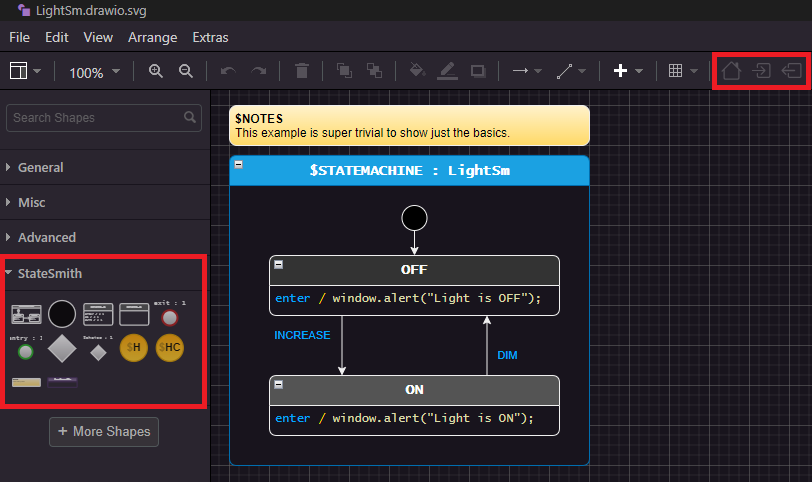
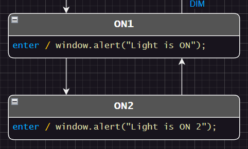
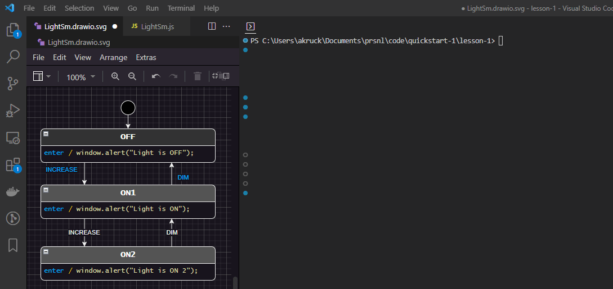

# Install The `draw.io vscode` Extension
You don't have to download the vscode extension, but it is highly recommended. It will automatically load our StateSmith plugin for draw.io which adds some very helpful features.

If you want to use the regular draw.io program or website, see [this link for details](https://github.com/StateSmith/StateSmith/wiki/Getting-started-using-draw.io-with-StateSmith).

Otherwise, install the excellent [vscode extension](https://marketplace.visualstudio.com/items?itemName=hediet.vscode-drawio).


<br>


# Open vscode In Project Repo Root (Or Each Lesson Dir)
Why? Simply because the `.vscode/settings.json` files in each lesson directory (or repo root) are setup to load the StateSmith plugin when you open a drawio file. More info available on [Use with vscode wiki page](https://github.com/StateSmith/StateSmith-drawio-plugin/wiki/Use-with-vscode) if you want to use different paths.


<br>


# Let's Edit The Diagram
Assuming you've installed the vscode extension above, open the `LightSm.drawio.svg` file with vscode.

The vscode-drawio extension will ask you if you want to load the StateSmith-drawio-plugin:


Click `Allow` if you trust it. I do :) You can see and even tweak [your local copy source](.vscode/StateSmith-drawio-plugin-v0.5.0.js).


<br>

# Confirm StateSmith Plugin Loaded
If everything worked as expected, you should see something like below. Note the highlighted sections.




<br>

# See Plugin How To Use Guide
The [Plugin How To Use Guide](https://github.com/StateSmith/StateSmith-drawio-plugin/wiki/How-To-Use) has lots of good tips with animated gifs.

[](https://github.com/StateSmith/StateSmith-drawio-plugin/wiki/How-To-Use)


<br>

# Add Another State
The [How To Use guide](https://github.com/StateSmith/StateSmith-drawio-plugin/wiki/How-To-Use) covers this in more detail, so we will be brief here.

Copy state `ON1` and rename it to `ON2`. Add transitions between the states.


<br>

# Add Transition Events
Select the transition from `ON2` to `ON1` and press `F2` to edit the transition label. Type in `INCREASE`.

Edit the other transition's label to be `DIM`.




<br>

# Save and Generate
Save the file, and run the code generation again.
```
dotnet-script code_gen.csx
```
You should see the following:
```
StateSmith Runner - Compiling file: `LightSm.drawio.svg` (no state machine name specified).
StateSmith Runner - State machine `LightSm` selected.
StateSmith Runner - Writing to file `LightSm.js`.
StateSmith Runner - Finished normally.
```

Notice that our state machine now has a state for `ON2`.




<br>

# draw.io Bugs 🐛
draw.io is a super awesome application, but it does have some bugs. Luckily, we can often have our plugin overcome them. Thank you open source!

If you run into an issue specific to draw.io, check our [draw.io plugin repo for issues](https://github.com/StateSmith/StateSmith-drawio-plugin/issues) and/or report there.

One draw.io bug that you will likely bump into is that you should [always exit all groups before saving](https://github.com/StateSmith/StateSmith-drawio-plugin/issues/25). Otherwise, draw.io will create an svg that is valid and can be used by StateSmith, but doesn't view properly.

There's also a [troubleshooting section](https://github.com/StateSmith/StateSmith-drawio-plugin/wiki/Troubleshooting) you can consult.


<br>

# Test It In The Browser 🌍
Same as before. Open `index.html` in a browser and send events to your state machine using the buttons.


<br>

# On To The Next Lesson
Checkout the [lesson 2 README.md](../lesson-2/README.md).
