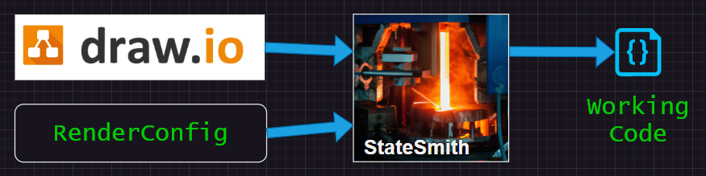
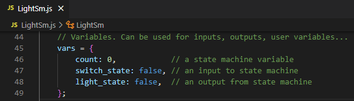
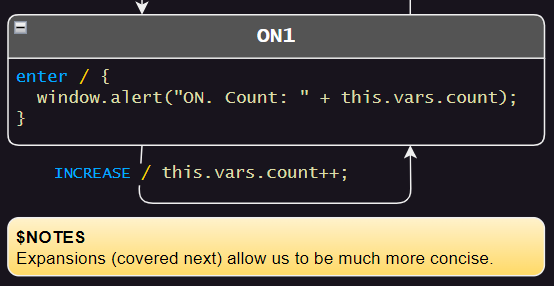
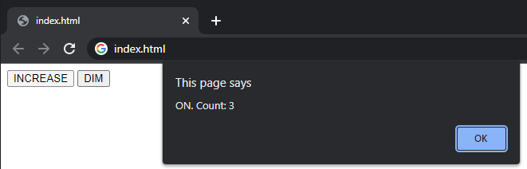

# Lesson 2 - Render Config & Variables
So far we've learned how to generate working state machines from diagrams, but they were very basic and limited.

What if the state machine needs to include functionality from another file, or declare variables? `RenderConfig` is the answer.




<br>

# WHAT!? This Is A Web Example!? 😱
Don't worry, there is a language specific example in a later lesson.

All the **non**-language specific examples will use html/javascript because everyone has a browser that can run them.


<br>

# RenderConfig - FileTop
We are going to add a basic render config class to our [code_gen.csx](./code_gen.csx) script:
```cs
#!/usr/bin/env dotnet-script
#r "nuget: StateSmith, 0.8.13-alpha"
using StateSmith.Output.UserConfig;
using StateSmith.Runner;

SmRunner runner = new(diagramPath: "LightSm.drawio.svg", new LightSmRenderConfig(), transpilerId: TranspilerId.JavaScript);
runner.Run();

///////////////////////////////////////////////////////////////////////////////////////

// This class gives StateSmith the info it needs to generate working code. This class can have any name.
public class LightSmRenderConfig : IRenderConfig
{
    // `FileTop` text will appear at the top of the generated file. Use for comments, copyright notices, code...
    string IRenderConfig.FileTop => """
        // Copyright: turtles, turtles, turtles...
        // You can include other files/modules specific to your programming language here
        let x = 55; // You can even output raw code...
        """;
}
```

Note that we changed the `SmRunner` line of code to add our render config.
```diff
-SmRunner runner = new(diagramPath: "LightSm.drawio.svg",                            transpilerId: TranspilerId.JavaScript);
+SmRunner runner = new(diagramPath: "LightSm.drawio.svg", new LightSmRenderConfig(), transpilerId: TranspilerId.JavaScript);
```

We also had to add another `using` statement near the top of our script file so that we can access `IRenderConfig`.
```cs
using StateSmith.Output.UserConfig;
```


<br>

# Code Gen and Check Generated File
Run your code generation script and check the top of the generated file [LightSm.js](./LightSm.js).
```
dotnet-script code_gen.csx
```

You should see something like this:
```js
// Autogenerated with StateSmith 0.8.13-alpha.
// Algorithm: Balanced1. See https://github.com/StateSmith/StateSmith/wiki/Algorithms

// Copyright: turtles, turtles, turtles...
// You can include other files/modules specific to your programming language here
let x = 55; // You can even output raw code...

// Generated state machine
class LightSm
{
    //...snip...
}
```


Try playing with the render config.


<br>

# Add Some `VariableDeclarations`
There are few ways to define variables for your state machine.

> Note: some object oriented languages like C# can have the generated state machine extend a user defined base class. The base class is a more convenient place to declare variables than what is shown here.

The `VariableDeclarations` section allows us to specify text and code to put in the state machine variables object. If there is no code in this section,
no state machine variable object will be created.

```cs
public class LightSmRenderConfig : IRenderConfig
{
    //...

    string IRenderConfig.VariableDeclarations => """
        count: 0,            // a state machine variable
        switch_state: false, // an input to state machine
        light_state: false,  // an output from state machine
        """;
}
```


<br>


# Use The Syntax For Your Language
Note that StateSmith does not parse the `VariableDeclarations` string. It outputs whatever is written there. Use the proper syntax for the output language you are generating for.

If you were using C/C++/C#, you might declare like `int count = 0;` instead.


<br>

# Code Gen and Check Output
Run your code generation script and check the generated file [LightSm.js](./LightSm.js).
```
dotnet-script code_gen.csx
```

You can see that a variables section has been added to your state machine:




<br>

# You Can Put Anything In `VariableDeclarations`
You can put anything valid for your language in the `VariableDeclarations` section. You might choose to do something like below.

```cs
public class LightSmRenderConfig : IRenderConfig
{
    //...

    string IRenderConfig.VariableDeclarations => """
        inputs: {
            switch_state: false,
        },
        outputs: {
            light_state: false,
        },
        internal: {
            count: 0,
        }
        """;
}
```

C allows you to do something similar with anonymous structures.


<br>

# How Do We Get Access To The `count` Var?
For javascript, you can access the count variable using `this.vars.count` as shown below.

> **TIP:** It is best to access state machine variables through Expansions (covered next) because the path to the variable is dependent upon the chosen language, algorithm, and potentially future options.



Feel free to run the code gen and play with the design by opening `index.html` in a web browser. Try making some changes.




<br>

# Diagram Based RenderConfig
You can actually define the render config options directly in the diagram if you want. See [this wiki page](https://github.com/StateSmith/StateSmith/wiki/Diagram-Based-Render-Config) for details.

In the future, we won't need to use .csx files at all.


<br>

# Onwards!
The next lesson shows how to use expansions - a powerful tool for concise and expressive state machine designs.

See [lesson 3 README.md](../lesson-3/README.md).
