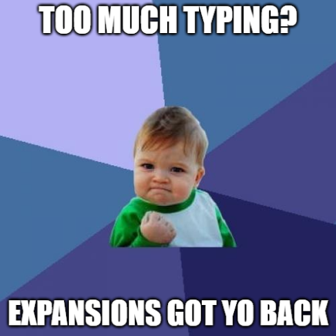
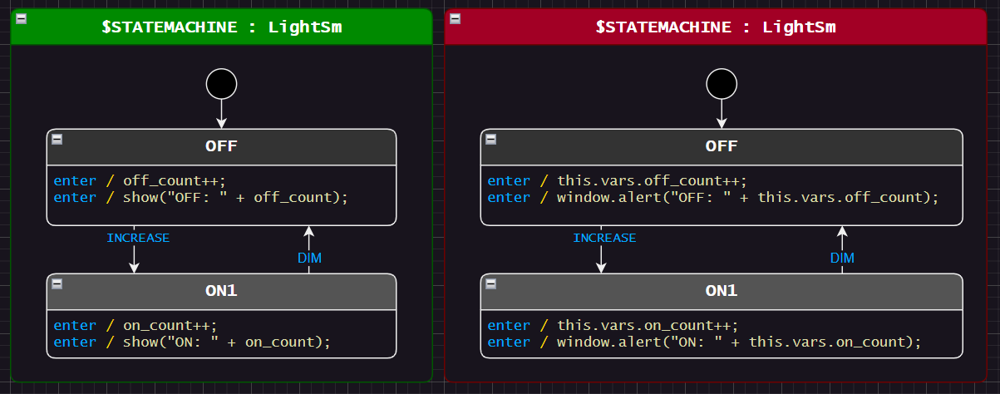
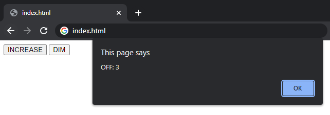
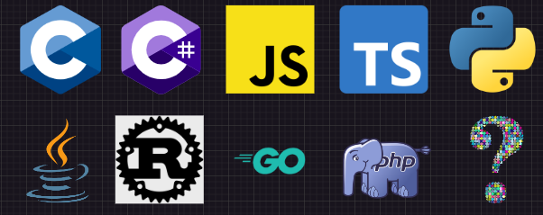

# Lesson 3 - Expansions
Wouldn't it be nice if we could just write `count` instead of `this.vars.count` in our state machine diagram?



Some object oriented languages like C# and C++ can have the generated state machine extend a user defined base class. This can often reduce or eliminate the need for expansions. This is covered in a later language specific section.

For those suckers for punishment (like me) coding in C, expansions are super useful.


<br>

# Where is my preferred programming language?
Don't worry, there is a language specific example in a later lesson.

All the **non**-language specific examples will use html/javascript because everyone has a browser that can run them.


<br>

# Expansions
StateSmith expansions act a lot like c macros or a template language and can often lead to easier to follow diagrams. You declare the expansions once and then use them throughout the diagram.

Compare the below two designs. Both are perfectly valid and equivalent. The green one uses Expansions.



Expansions allow you to write `off_count` in your diagram and have StateSmith output `this.vars.off_count` in your generated code.


<br>

# Syntax
The syntax for describing expansions is just C# code. If the syntax looks a bit weird, take a look at c# expression body members. The user written C# expansions are executed during code generation. An expansion can do things like simple text substitution, call another expansion, check a database, get the current date/time... whatever you can code up.

```cs
public class MyExpansions : UserExpansionScriptBase
{
     // a simple variable expansion
    string off_count => AutoVarName(); // explained below

    // a function expansion
    string show(string message) => $"""window.alert({message})"""; // c# interpolated raw string
}
```


<br>

# Special Expansions
There are a few StateSmith helpers that you can use for expansions.

`VarsPath` expands to the state machine variables path.
```c#
string oc => VarsPath + "off_count";
// expands to `this.vars.off_count` for js, c#
// expands to `sm->vars.off_count` for c
```

`AutoNameCopy()` expands to just the expansion name.
```c#
string turtle_topple() => AutoNameCopy();
// expands to "turtle_topple"

string menu_at_top() => "Display_" + AutoNameCopy() + "()";
// expands to "Display_menu_at_top()"
```

`AutoVarName()` equivalent to  `VarsPath + AutoNameCopy()`.
```c#
string off_count => AutoVarName();
// expands to `this.vars.off_count` for js, c#
// expands to `sm->vars.off_count` for c
```


<br>

# Run Code Gen
Run your code generation script and check out the generated file [LightSm.js](./LightSm.js).
```
dotnet-script code_gen.csx
```

Take a look at the `OFF` state's generated code:

```js
OFF_enter()
{
    // ...
    
    // OFF behavior
    // uml: enter / { off_count++; }
    {
        // Step 1: execute action `off_count++;`
        this.vars.off_count++;
    } // end of behavior for OFF
    
    // OFF behavior
    // uml: enter / { show("OFF: " + off_count); }
    {
        // Step 1: execute action `show("OFF: " + off_count);`
        window.alert("OFF: " + this.vars.off_count);
    } // end of behavior for OFF
}
```

Note that the output code contains a comment with the original diagram text prior to expansion.

Feel free to run the code gen and play with the design by opening `index.html` in a web browser. Try making some changes.




<br>

# Helpful Tips
See the [Expansions wiki page](https://github.com/StateSmith/StateSmith/wiki/Expansions) for more tips and as a quick reference.


<br>

# Expansion syntax must match use in diagram

If you use an expansion like `menu_at_top()` (a function call) in a diagram, the expansion you write must also be a function otherwise it won't match.

This will match:
```c#
string menu_at_top() => "Display_menu_at_top()";
```

This will NOT match in diagram:
```c#
string menu_at_top => "Display_menu_at_top()";
```

And vice versa. This is similar to how the C preprocessor works with macro definitions.


<br>

# Expansions Enable Multiple Language Output
Sometimes I use a single state machine diagram to generate code for multiple output languages. Expansions are key to enabling this. There are a few ways to do this. I can create more documentation for this if people are interested (discord or GitHub discussions). A quick tip: you can inherit common expansions via extending a base class or use composition.





<br>

# It's **Time** For The Next Lesson!
In the next lesson, we are going to take a look at using expansions to enable time based transitions.

See [lesson 4 README.md](../lesson-4/README.md).
